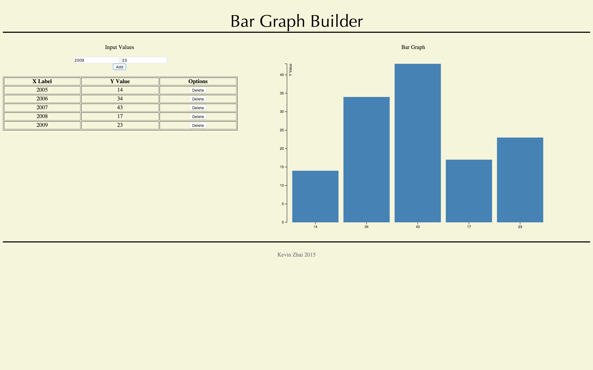

# CIS 197 Final Project  

D3.js powered Bar graphing Web App 
Kevin Zhai  

Hosted on https://kzd3.herokuapp.com/  

A Node.JS WebApp that allows the user to create custom bar graphs  
Features:  
-Input system allowing user to enter numerical values for the graph - handled by Backbone and Jquery 
-SVG Graphing - handled by D3.js 
-Express server deployed through Heroku 
-Using Grunt task manager with Eslint and Jshint plugins 
